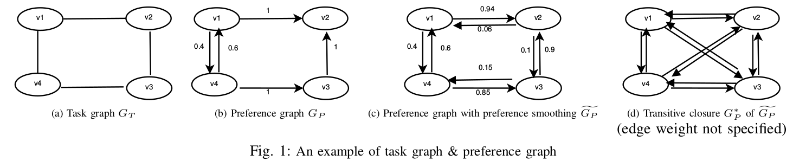

# Pairwise Ranking Aggregation by Non-interactive Crowdsourcing with Budget Constraints

If you find this repository helpful, please cite our paper [Pairwise Ranking Aggregation by Non-interactive Crowdsourcing with Budget Constraints](https://ieeexplore.ieee.org/stamp/stamp.jsp?tp=&arnumber=7980235&tag=1).

```
@inproceedings{cai2017pairwise,
  title={Pairwise Ranking Aggregation by Non-interactive Crowdsourcing with Budget Constraints},
  author={Cai, Changjiang and Sun, Haipei and Dong, Boxiang and Zhang, Bo and Wang, Ting and Wang, Hui},
  booktitle={2017 IEEE 37th International Conference on Distributed Computing Systems (ICDCS)},
  pages={2567--2568},
  year={2017},
  organization={IEEE}
}
```

---

<p align="center">

</p>

---

## Code Usage:

The main() function is provided in the `main_SATD.cpp` file. The experiments in our ICDCS 2017 paper are finished by this function.

## Input Parameters:

> Note that all the parameters are string variables, which will be automatically changed into appropriate variables (like, string to double via function stod(), string to int via stoi(), etc.).


- **baseAddress**, an directory storing the task assignment graphs, each of which is saved in a "txt" file. E.g., = `E:/OpenCVProjects_CCJ/CrowdSourcing2/ICDE-2017/GT/GT-v100/`. Please pay attention the last "/" which is necessary.

- **k**, finding top-k paths using TA or SA. E.g., k = 3, meaning to return top-3 optimum paths.

- **vertexNum**, number of the vertex,  this value can be set any initial value, since it be assigned later. E.g., vertexNum = 20;

-  **d**, degree of the graph, this value can be set any initial value, since it be assigned later. E.g., d = 5.

- **T**, temperature used in the Simulation Annealing algorithm. E.g., T = 50000.

- **coolRate**, the rate of cooling, still used in the Simulation Annealing algorithm. E.g.,  coolRate = 0.95.

-  **IterationNum**, the predefined iteration times for Simulation Annealing algorithm, E.g.,  IterationNum = 1000.

- **ExperimentTimes**, meaning how many times we will do the experiments for getting an averaged result. E.g, IterationNum = 10.

-  **distribuion_type**, there are two types of distribution used to generate the simulation dataset considering the variety of the workers' qualities.  **distribuion_type = 0**, means Gaussian distribution;  **distribuion_type = 1**, means uniform distribution.

-  **permuStartingIdx**, please set this value as 1. Actually it does not work during the experiments, it is not deleted just because I do not want to change the order of parameters too much.

-  **workerNum**, the number of workers for each pairwise comparison,  that is, how many workers will work on the pairwise comparison (i.e., one edge). E.g., workerNum = 20, or 50.

-  **ratio**, selection ratio, different selection ratio means different degree in the task assignment graph. This value can be set any initial value, since it be assigned later, e.g., ratio = 0.5.

- **SA_flag**, different methods to find an initial path for Simulation Annealing algorithm. SA_flag = 2 is used in our methods. The different values are explained in the function of TSPalgorithm::Run() located in the file of TSPalgorithm.cpp.

- **isDisplay**, a boolean value used to print or not print information. Set it 0 (i.e., false) for disabling the printing. 

- **tasks_ratio**, the ratio of all the pairwise comparison tasks, e.g, ratio = 0.1, that means each worker will pick at random up to  500 * 0.1 = 50 pairwise comparison tasks to vote, given, like, 500 total pairwise comparison tasks. 

- **Worker_quality**, Gaussian variance to control the worker's quality.
